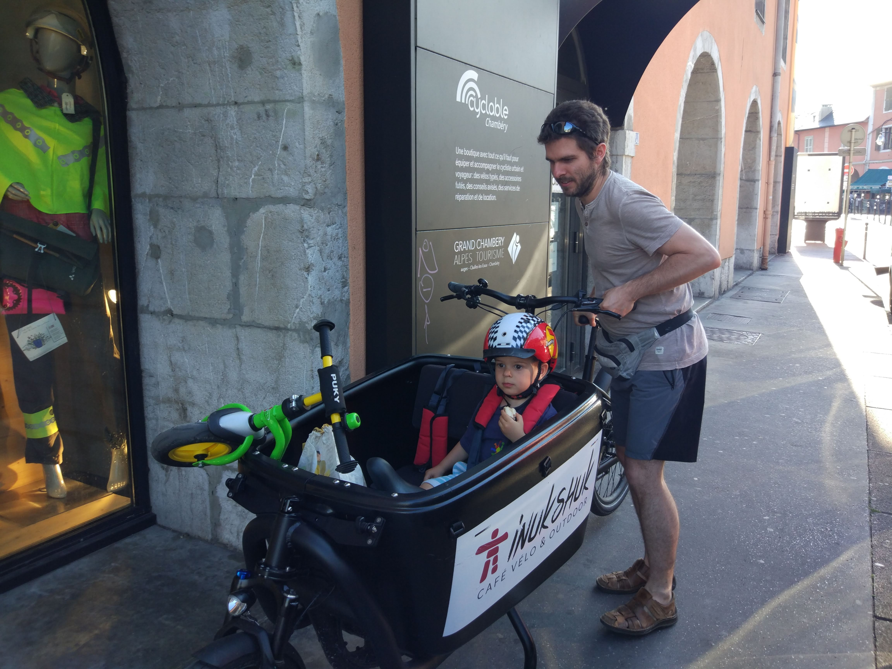

I'm Thomas Capelle (cape), Staff Machine Learning Engineer at [Weights & Biases](https://wandb.ai/capecape) (now part of CoreWeave), on the AI Applied Team.

These days I build [Senpai](https://wandb.github.io/senpai/), an autonomous ML research framework (ICML 2026), and use it on CFD surrogate modeling (AirfRANS, TandemFoilSet, DrivAerML) and aerodynamics with the **Aston Martin Aramco Formula One Team**. Most of the interesting work is flow matching and diffusion models for pressure and velocity fields.

Before that I spent several years on LLMs: fine-tuning, aligning, evaluating, quantizing, deploying, and making `wandb` useful to practitioners through [wandb/examples](https://github.com/wandb/examples), MLOps content and [Fully Connected](https://wandb.com/fc). Earlier still I used deep learning for short-term solar forecasting at [Steady Sun](https://steadysun.fr/). Background in Urban Planning, Combinatorial Optimization, Transportation Economics and Applied Math.

{.profile-photo fig-alt="Profile photo"}

## Experience {.unnumbered}

### Weights & Biases by CoreWeave {.company}
**Staff ML Engineer** (2021–present)

- [Senpai](https://github.com/wandb/senpai) — an autonomous ML research framework: advisor and student agents on Kubernetes coordinating entirely through GitHub PRs and labels, with W&B as the experiment record (ICML poster)
- State-of-the-art CFD surrogate modeling with the Aston Martin Aramco Formula One Team — neural PDE surrogates for pressure and velocity fields, with flow matching / diffusion residual models to recover high-frequency detail and quantify uncertainty
- Large-scale distributed training on GPU clusters: elastic multi-node runs, fault tolerance, checkpointing and resilient recovery
- LLMs everywhere: fine-tuning, aligning, using, deploying, quantizing, eating for breakfast
- Improving user experience through examples in [wandb/examples](https://github.com/wandb/examples)
- Creating content for [Fully Connected](https://wandb.com/fc) on how to make machine learning better
- Helping companies integrate wandb into their MLOps workflows

### Steady Sun {.company}
**ML Engineer** (2020-2021)

- Developing next version of short term forecasting algorithm based on sky imager
- Integration of ML tools into the Steady Sun code base
- R&D in deep learning for detection/segmentation and forecasting of sky images
- Collaboration with NVIDIA AI on deployment and production of DL models

### INES CEA {.company}
**Research Engineer** (2018-2020)

- Development of algorithms for failure detection in photovoltaic systems
- Deep learning model for parameter regression of IV-curves of photovoltaic modules
- Thermal image segmentation and classification model
- Project engineer and coordinator for a Franco-Chilean partnership, international cooperation with multidisciplinary laboratories

### Inria {.company}
**Research Engineer** (2017-2018)

- Integration of spatial models with air quality and forecast models

### Inria STEEP {.company}
**PhD Researcher** (2013-2016)

- Development of mathematical frameworks for urban/transport model calibration
- Multidisciplinary team work (engineers, economists, urbanists)
- Supervision of interns
- International conferences and peer-reviewed publications

### CIRRELT {.company}
**Master Intern** @ [Polytech Montréal](https://www.cirrelt.ca/) (2011)

- Location and routing modelling: development of algorithms for logistics
- Implementation of a [column generation algorithm](https://www.sciencedirect.com/science/article/pii/S0377221718304740)

### Universidad de los Andes {.company}
**Assistant Professor** (2010)

- Analysis and algebra for engineers

## Publications {.unnumbered}

The full list of my publications is available via [Google Scholar](https://scholar.google.com/citations?hl=en&user=54AmAVUAAAAJ&view_op=list_works&gmla=AJsN-F7KXg9I52kC7hCSnQgV_2MTcXiM1PuhuT_NEaE2x3tej2k7jhuagVXFkllIfU7LEkrYY_oBISUxD2LxrZ78F1NLsFmyEoO3Lfrqree5d3tRiPU94-s)

## Education {.unnumbered}

::: {.grid}

::: {.g-col-4}
**PhD in Computer Science**  
[Université de Grenoble](https://www.uga.fr)  
2017
:::

::: {.g-col-4}
**MSc in Civil Engineering - Transport**  
[Universidad de Chile](https://www.uchile.cl)  
2013
:::

::: {.g-col-4}
**Mathematical Engineer**  
[Universidad de Chile](https://www.dim.uchile.cl)  
2013
:::

:::

## Languages {.unnumbered}

::: {.d-flex .justify-content-between}
- **Spanish** (mother tongue)
- **French** (native)
- **English** (full professional proficiency C1)
:::

---

::: {.d-flex .justify-content-between}
[Download LaTeX CV](https://github.com/tcapelle/CV/releases/latest) | 
[Kaggle Profile](https://www.kaggle.com/tcapelle)
:::
