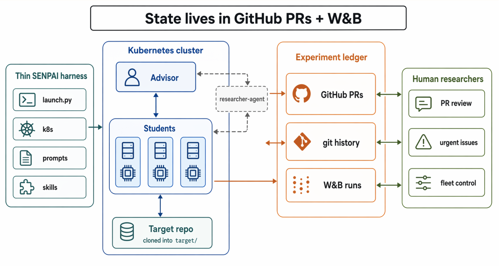
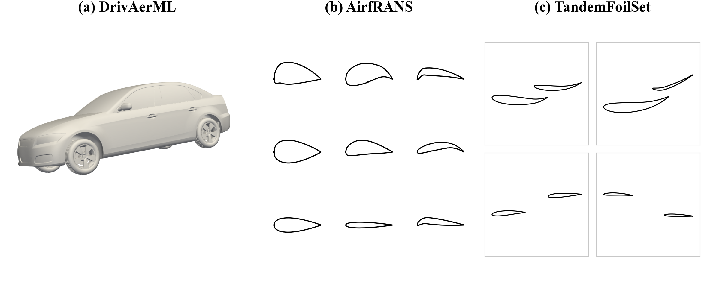
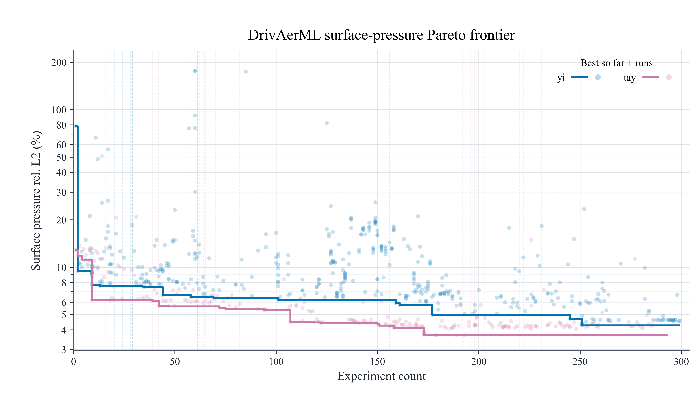
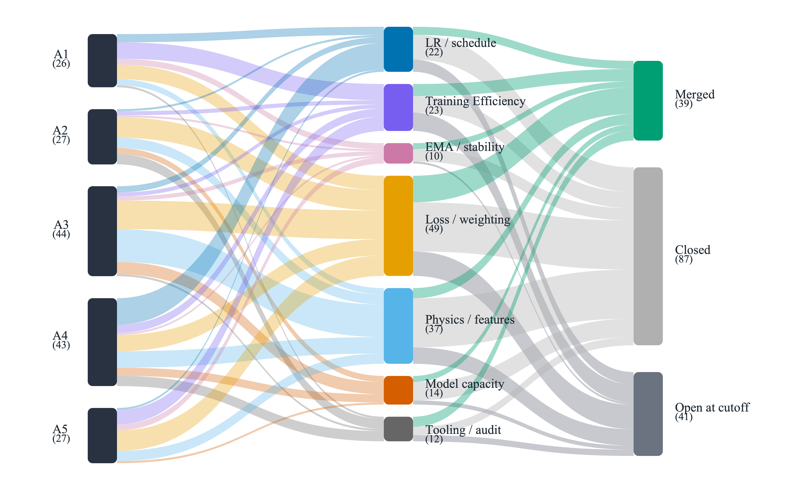

We just presented **SENPAI** (Self-ExperimentatioN for Physical AI) at the [AI for Science Workshop at ICML 2026](https://openreview.net/forum?id=g0bJFA9gVT), with my co-authors Morgan McGuire and Justin Hodges at W&B / CoreWeave.

SENPAI is a semi-autonomous ML research harness: an `Advisor` agent reads the current experiment ledger, proposes a literature-grounded hypothesis as a draft PR, and assigns it to a GPU-backed `Student`. The Student checks out the branch, modifies the training code, runs the experiment, logs metrics to W&B, and reports results in the PR. The Advisor then merges, requests revision, or closes the line of inquiry. Humans steer by opening GitHub issues or commenting on PRs — steering is occasional, not constant.

## Why ground agent state in PRs, not memory

Most autonomous-research agents keep hypotheses, results, and next steps in their own scratchpads or context window. That's fragile: state gets lost across context compactions, isn't inspectable by a human without reading agent transcripts, and can't easily be recovered if a run crashes.

SENPAI's central design choice is to ground the research loop in systems of record teams already use and trust: pull requests and git history for hypotheses, code changes, and review; W&B for configs, metrics, checkpoints, and traces. Every hypothesis, diff, and training result becomes both machine-queryable and researcher-reviewable — a durable, auditable experiment ledger rather than something living only in an agent's head.

## CFD as the proving ground

SENPAI is problem-agnostic, but we evaluated it on CFD-surrogate recipe search, where performance depends on architecture, optimization, loss design, normalization, and physics-aware considerations — a space where strong recipes usually require both ML expertise and domain knowledge that many teams don't have in one place.

Starting from Transolver-style baselines, SENPAI discovered improved recipes across all three benchmarks:

- **DrivAerML**: best single-model surface- and volume-pressure relative-L2 error among compared references, with lower wall-shear-stress error, at **3.56%** surface rel-L2
- **AirfRANS**: surface MSE of **0.00130**, below every compared reference (vs. 0.0043 baseline)
- **TandemFoilSet**: lower cruise-uniform-split full-field MSE (**1.7e-3**) than the reported benchmark

## Scale, and where it actually breaks

Across the research programme, SENPAI produced over **3,000 PRs**, **11,000 tracked training runs**, and ran with up to **59 concurrent Student agents** over multi-day deployments (9 days at the longest).

We also audited a 24-hour fleet trace — 53,022 Claude requests, 5.24B tokens — to understand failure modes at this scale. The dominant failures weren't bad science: they were monitor-driven context bloat, brittle tool interfaces, checkpoint/result-capture gaps, and state-reconciliation issues. Of 39 completed trainings, 38 produced PR documentation. The interesting failures are systems failures, not reasoning failures — which is exactly the kind of thing an observability-first design is supposed to surface.

## Links

- Paper (OpenReview): [SENPAI: Self-ExperimentatioN for Physical AI — An Observability-Based Research Harness](https://openreview.net/forum?id=g0bJFA9gVT)
- Project site: [wandb.github.io/senpai](https://wandb.github.io/senpai/)
- Code: [github.com/wandb/senpai](https://github.com/wandb/senpai)
